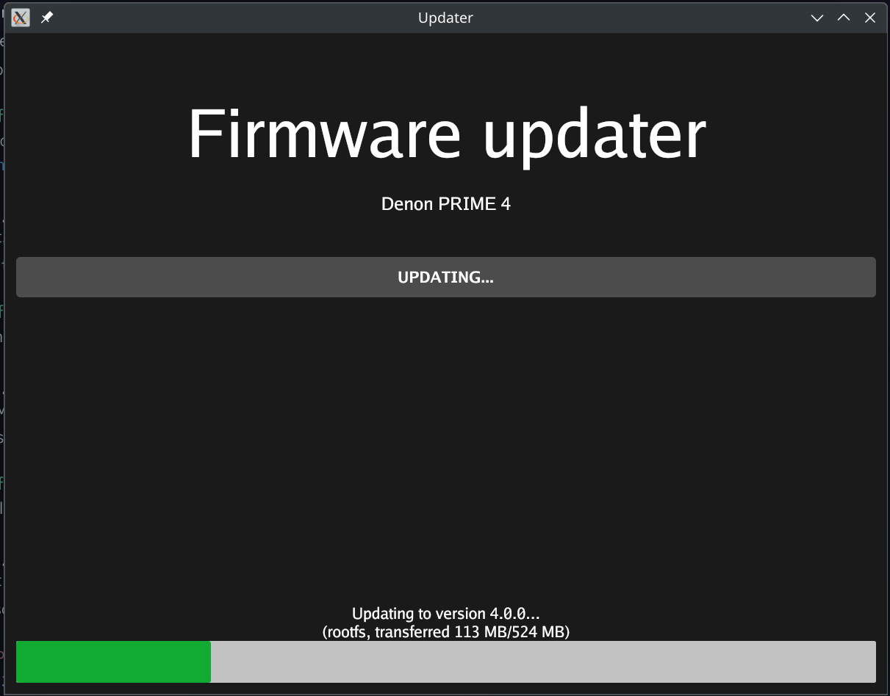

# Updater

A tool to flash images onto engine OS devices.

## Implementation

The updater uses [Google's Go wrapper around libusb](https://github.com/google/gousb) to reimplement [FastBoot](https://android.googlesource.com/platform/system/core/+/master/fastboot/README.md), the protocol used for flashing inMusic devices (and various other Linux-based devices).

It can be built with either a [purely Go implementation of xz](https://github.com/ulikunitz/xz) or, if go build tag `libxz` is set, [a cgo wrapper around the native xz library](https://github.com/jamespfennell/xz) for efficient on-the-fly image decompression. The variable in `go/Makefile` defaults to setting the `libxz` tag. Some code had to be copied over to my repository to allow determining the exact amount of data to be transferred to the device as it is required for the flashing procedure. This is also then used for progress display purposes.

Matching device IDs as well as firmware version is read from the generated Device Tree Blob file, SHA1 checksum verification for the images contained in the DTB is also implemented. All other info is read from a supplied `config.toml` file of which its entire structure is packed into a Go `struct` type.

The GUI is implemented using [gioui](https://gioui.org/). This allows clear separation of state and UI rendering without over-complications usually encountered with other frameworks I've so far tried. A Go-side built-in font is used for rendering the UI to avoid system font rendering issues in Wine during testing. It was originally even slower while I was using a data copy buffer in the FastBoot code of 4096 bytes, increasing that to 16384 bytes helped. I suspect I could set it even higher for more performance but didn't test it yet.

This is not the most optimized implementation as the `fastboot` CLI is able to flash the entire firmware within 30 seconds whereas this implementation takes slightly over twice as long.

The updater generation script has been modified to use this file and to not copy the updater file to manipulate 7z to include all files without paths anymore.

The devices list also has been updated to carry proper display names for every device, the name is used as part of the generated config.toml file for the new updater.

## Known issues

- Updater does not properly handle quitting the application yet as it will allow immediate termination using the Close button. This is meant to be blocked during the flashing process.
- The updater has to reinitialize libusb after every command issued to the device. It is unclear whether that is a limitation of the fastboot implementation on the device or whether it's an implementation issue in the updater code.
- The updater sometimes runs into the device being busy due to its own interactions with libusb.
- A [purely Go implementation of libusb](https://github.com/karalabe/usb) could not be used as it refuses to detect most of the USB devices, including the Denon PRIME 4 I tested against when it was hooked up via USB/IP. With native libusb it worked without issues whatsoever and libusb is also easy to cross-compile.

## References

- FastBoot protocol: https://android.googlesource.com/platform/system/core/+/master/fastboot/README.md
- OEM unlock command: https://github.com/RedHate/Unbricking-inMusic-Products#step-4---unlock-the-system-for-writing-using-fastboot
